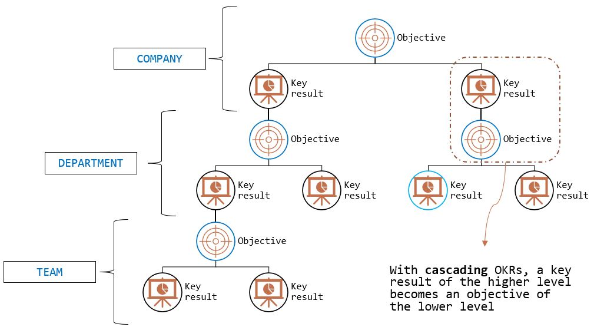

By adopting the OKR methodology, Agile Lab goes beyond the well-known limits of most organizations which are based on a _command-and-control_ model.

As a matter of fact, most of the traditional organizations deal with
slow decision-making processes, difficulties in keeping a high level of innovation, and a lack of employees' commitment and ownership.

What are OKRs?
# OKR
**OKR (Objective and Key Result)** is a goal-setting framework conceived to spread the company's strategy among employees and to support the efficiency in the execution of tasks with a transparent and collaborative approach.

From a historical point of view, the OKR method is generally attributed to Andrew Grove, who introduced it to Intel during his tenure and later to John Doerr at Google.

As the name suggests, an OKR is made of an _objective_ and some _key results_

- the **objective** describes the company priorities in the short term, consistently with the company purpose and the long-term vision.
  This is the _outcome_ of the process since it explains "what" we want to achieve.

- **key results** are a list of results that must be numeric, measurable, and linked to the objective. They show how near the company is to the objective.
  They are the _output_ of the process since they explain "how" the goal will be achieved.

As a rule of thumb, a company should have no more than 2 OKRs per cycle. This will lead to the choice of real priorities. Ideally, one objective could be more aspirational and the other one more technical.

The cycle should last from 3 to 6 months.

A good objective should be:
- feasible in one cycle
- shared among the organization members
- inspirational and not numeric
- clearly in line with the company business
- challenging, but realistic
- under the team's control
- in the form "_verb_ + _what_ do you want to reach + _why_ + the application field"

Good key results should:
- be measurable on a weekly basis
- not be binary
- not exceed the number of 3-4 per objective
- clearly show how close the goal is
- be limited to the only ones useful to reach the target
- represents 100% of the objective
- not be influenced by external actors and dependencies
- in the form "_verb_ + _what_ will be measured + the _extension_ of the result [owner]"

This is an example of a good OKR:
- OBJ: Increase the employees' digital skills to sustain the ongoing digital transformation process of the company and to reduce costs by the end of June
- KR1: Write a gap-analysis document with x pages comparing the internal skills to the ones of the reference market [owner: Training]
- KR2: Reduce digital experts' turnover from x% to y% [owner: Peopleops]
- KR3: Hire x digital experts [owner: HR]
- KRn: ...

## Cascading OKR

One of the most powerful aspects of the OKR framework is the ability to align each employee's effort and decision, from the front line through the most operational areas to the company strategy.

This is possible because **a key result of the higher level becomes an objective of the lower level**. 
These are called **cascading** OKR

**Company OKRs** are at the top level and **Team OKRs** are at the lower level.

Every company should choose the correct number of cascading levels according to their cultural and organizational patterns: 
some organizations use more OKR levels, others can choose to not use cascading OKRs at all.

## Types of OKRs

Many organizations (e.g. Google) divide two types of OKRs: **committed** and **aspirational**. 
They have different purposes and they can be designed, interpreted, and acted upon in different ways.

- **Committed**
  
  These are goals that have to be reached in order to achieve the objective.
  
  Everyone at the organization and at the team level recognise that they must be met in full. In general, committed OKRs are to be achieved within a set time frame.
  
  For example, if the objective states "To become partner of a vendor" and the vendor requires at least a minimum number of certifications, the "achieve 10 certifications" is a committed OKR because it must be totally achieved.
  
- **Aspirational**

  On the other hand, aspirational OKRs reflect bigger-picture, higher-risk and more future-tilting ideas. They show how we’d like the world to look. They are sometimes called *10x goals* or *moonshots*.

  Regarding aspirational OKRs, Larry Page said "If you set a crazy, ambitious goal and miss it, you’ll still achieve something remarkable.”

  With aspirational OKRs, there is no clear path to  get there—and no real knowledge of what resources will be required.

  The expected success score of an aspirational OKR is 70%.

The relative weighting of these two types of OKRs is a cultural question.

# OKR process in ROMBO 

 - Within Juanuary the company wide OKRs for the year are defined. (Owner - Andrea)
 - Every person in the company has her own OKRs, checked and modified for each quarter. The definition is made collaboratevely. (Owner - Andrea)

------

# Resources
- LMS course "OKR 101"
- whatmatters website
- okrexamples website

# Credits

- Measure what matters [John Doerr]
- Radical Focus [Christina Wodtke]
- OKR Performance [Francesco Frugiuele, Matteo Sola]
- https://www.whatmatters.com/
